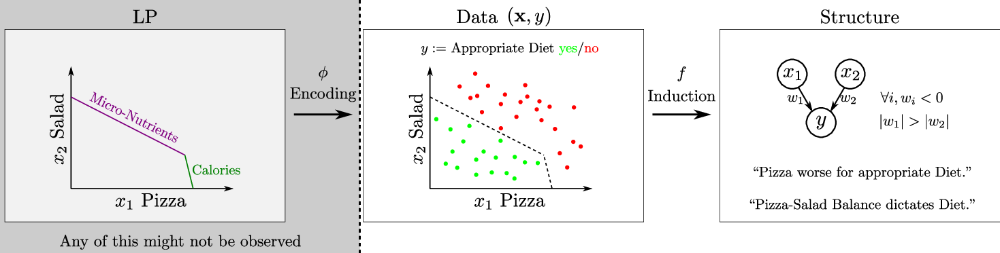

#### Finding Structure and Causality in Linear Programs

Official code repository to corresponding paper presented at [ICLR 2022 Workshop on "Elements of Reasoning: Objects, Structure and Causality"](https://objects-structure-causality.github.io/).

Link to [official OpenReview of the paper (id = rc8l8SOU9ec)](https://openreview.net/forum?id=rc8l8SOU9ec).

***Schematic View on the Problem Setting.*** Left, the possibly unobserved underlying Linear Program (LP) which is being encoded into a data set. Middle, this data might consist of diets paired with a label indicating their “healthyness”. Right, performing an induction reveals reconstructive properties of the original LP implicit in the data, e.g. pizza (x1) has greater influence on whether diet is healthy or not (y).

See `exp-graphs-from-lps.py` to reproduce the experiments from the paper.
